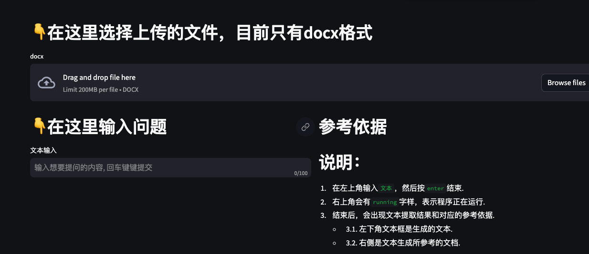
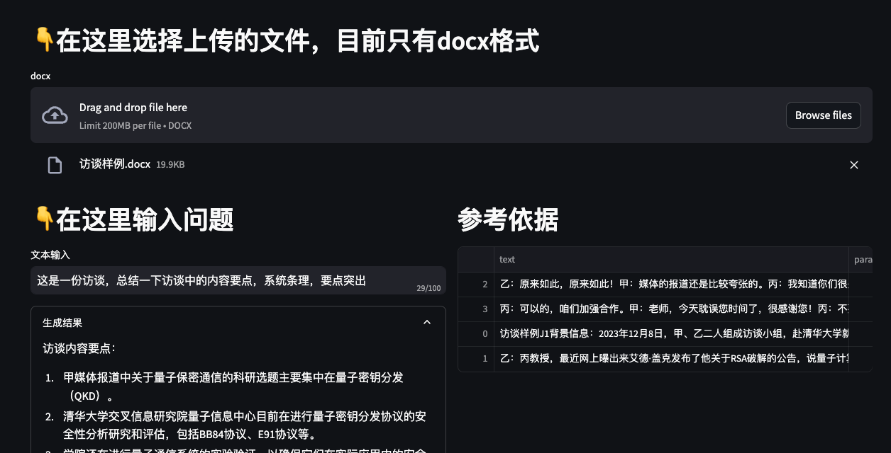

## 文档搜索问答
外挂文档，搜索增强（RAG）的一个简单demo。支持上传文件并提问


## 用法

### 命令行形式
1. `demo.py`文件里面

```python 

if __name__ == "__main__":
    global_dir = "政策归档文件" # 你自己的文件夹

    kl = KnowLedge(global_dir=global_dir)
    res, data = kl.search_result(question_str="大学生创业有什么补贴") # 你想问什么呢
    print(res)
    print(data)
```
### web端
```bash
streamlit run web_ui.py --server.fileWatcherType none
```




